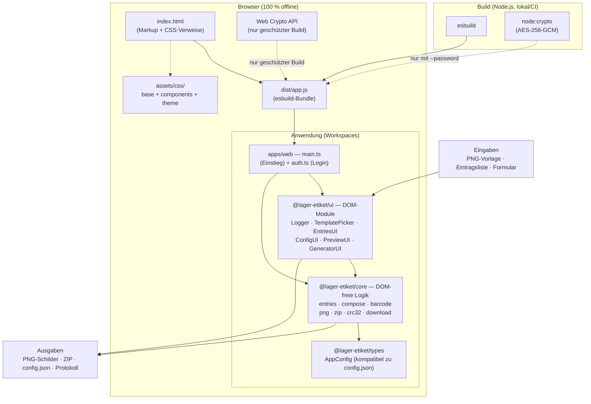
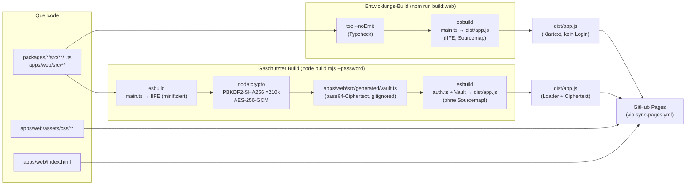
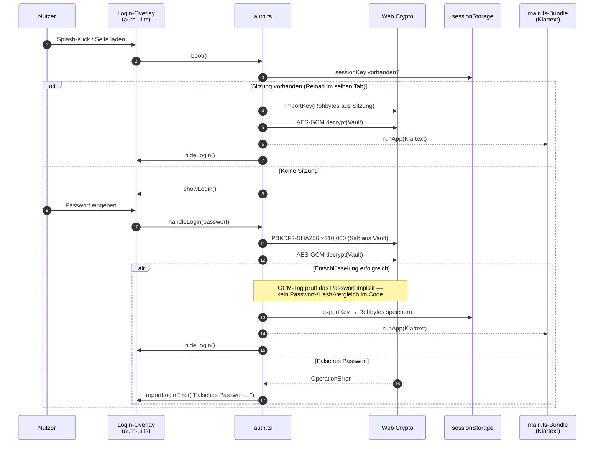
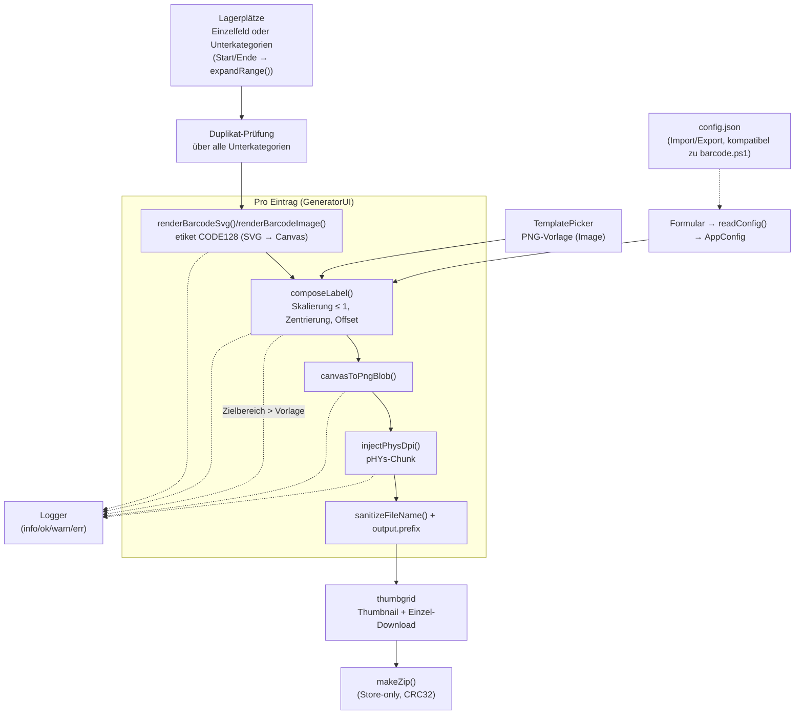
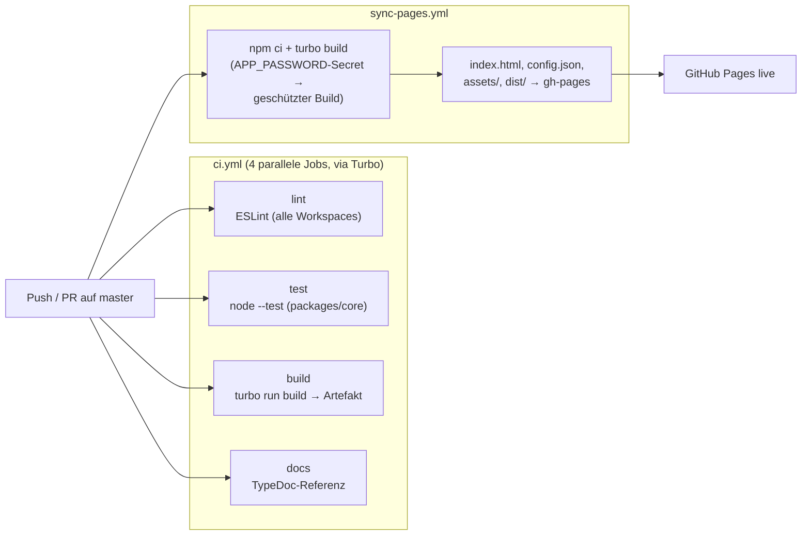

# Lager-Barcode-Generator

Erzeugt aus einer Liste von Lagerplatz-Bezeichnungen (z. B. `01A01`) fertige
Etiketten-Bilder: pro Zeile ein **Code-128-Barcode** mit lesbarem Klartext
darunter.

## Architektur — Lagerplatz-Barcode-Generator (Monorepo)

Dieses Dokument beschreibt die Architektur des Projekts als **Monorepo**
(npm Workspaces + Turborepo): Module, Build-Pipeline, Authentifizierung
und Datenfluss.

---

## 1. Systemübersicht

---

## 2. Module und Verantwortlichkeiten

### @lager-etiket/core — DOM-freie Logik

Alle Funktionen sind rein bzw. arbeiten nur mit Blob/ArrayBuffer und sind
deshalb einzeln unit-testbar (`packages/core/test/`).

| Modul               | Exporte                                                     | Zweck                                                                                                                           |
| ------------------- | ----------------------------------------------------------- | ------------------------------------------------------------------------------------------------------------------------------- |
| `entries.ts`        | `parseEntries`, `sanitizeFileName`                          | Eintragsparsing (Kommentare, Trim, Duplikat-Abbruch), Dateinamen-Bereinigung                                                    |
| `validate.ts`       | `validateEntry`, `findInvalidEntries`, `MAX_CODE_LENGTH`    | **Eingabegate** (ADR-0003): Druckbarkeit + etiket-Encoder als finale Instanz, bevor ein Code gerendert wird                     |
| `errors.ts`         | `AppError`, `describeError`, etiket-Fehler-Re-Exports       | **Zentrale Fehlertaxonomie** (ADR-0004): etiket-Fehler + Projekt-Fehler + Meldungs-Mapper für alle Ausgabestellen               |
| `ranges.ts`         | `expandRange`, `findDuplicates`, `MAX_RANGE_SIZE`           | Start/Ende-Bereiche expandieren (Präfix + Ziffern-Suffix), Duplikate über Bereiche finden                                       |
| `compose.ts`        | `composeLabel` (async), `ComposeResult`                     | **Herzstück**: Skalierung + Zentrierung des Barcodes im Zielbereich; Formel bewusst identisch zu `barcode.mjs` (`composeLabel`) |
| `barcode.ts`        | `renderBarcodeSvg`, `renderBarcodeImage`, `canvasToPngBlob` | etiket-Wrapper (CODE128, SVG-Rendering; `renderBarcodeImage` rastert mit `renderDpi`, siehe ADR-0002)                           |
| `png.ts`            | `injectPhysDpi`                                             | pHYs-Chunk (DPI) in PNG injizieren                                                                                              |
| `zip.ts`            | `makeZip`, `ZipEntry`                                       | Store-only ZIP-Writer                                                                                                           |
| `crc32.ts`          | `crc32`                                                     | CRC32 (IEEE) für ZIP + PNG                                                                                                      |
| `config.ts` (in ui) | `readConfig`, `applyConfig`, `toggleAreaFields`             | Formular ↔ `AppConfig`                                                                                                          |
| `download.ts`       | `downloadBlob`                                              | Browser-Download auslösen                                                                                                       |

### @lager-etiket/ui — DOM-Module

| Modul                 | Klasse/Funktionen                            | Zuständig für                                                                                                                                    |
| --------------------- | -------------------------------------------- | ------------------------------------------------------------------------------------------------------------------------------------------------ |
| `dom.ts`              | `$()`                                        | `getElementById` mit Fehler bei fehlender ID                                                                                                     |
| `logger.ts`           | `Logger`                                     | Protokoll-Panel (info/ok/warn/err), Speichern als .txt                                                                                           |
| `splash.ts`           | `initSplash`                                 | Begrüßungs-Overlay bis Klick                                                                                                                     |
| `template-picker.ts`  | `TemplatePicker`                             | Dropzone, Vorlagen-Vorschau, Change-Events                                                                                                       |
| `entries-ui.ts`       | `EntriesUI`                                  | Textarea/.txt-Import, Duplikat-Anzeige, Vorschau-Select                                                                                          |
| `config-ui.ts`        | `ConfigUI`                                   | config.json Import/Export/Reset                                                                                                                  |
| `preview.ts`          | `PreviewUI`                                  | Einzelvorschau + Zielbereich-Overlay (Theme-Farbe `--preview-overlay`)                                                                           |
| `generator.ts`        | `GeneratorUI`                                | Stapel-Lauf (Batches mit je eigener Config), Progressbar, Thumbnails, ZIP-Download                                                               |
| `template-gallery.ts` | `TemplateGallery`                            | Vorlagen-Galerie aus `public/templates/templates.json`, klickbare Karten, `restoreLast()` für Persistenz                                         |
| `config-library.ts`   | `ConfigLibrary`                              | Dropdown aus `public/configs/configs.json`, lädt gewählte Config ins Formular, `applyDefault()` lädt den Projekt-Standard beim Start             |
| `theme.ts`            | `initThemeSwitcher`                          | Catppuccin-Theme-Umschalter (4 Flavors), Persistenz in localStorage, Initial-Fallback über `prefers-color-scheme` (hell → Latte, dunkel → Mocha) |
| `persistence.ts`      | `loadSetting` u. a.                          | Sichere localStorage-Helfer (try/catch, offline-tolerant)                                                                                        |
| `view-settings.ts`    | `initViewSettings`                           | Stellt Overlay-Modus („Zielbereich einzeichnen") und zuletzt gewählte Galerie-Vorlage beim Start wieder her                                      |
| `batches-ui.ts`       | `BatchesUI`                                  | Einzelfeld ↔ Unterkategorien-Umschalter, Start/Ende-Bereiche, Batch-Config-Dropdowns                                                             |
| `lightbox.ts`         | `initLightbox`, `openLightbox`               | Großansicht für Vorschau/Thumbnails (Klick, ×, Esc)                                                                                              |
| `auth-ui.ts`          | `showLogin`, `hideLogin`, `reportLoginError` | Login-Overlay (nur geschützter Build)                                                                                                            |

### Einstiegspunkte

| Datei                  | Wird gebaut als                             | Zweck                                                        |
| ---------------------- | ------------------------------------------- | ------------------------------------------------------------ |
| `apps/web/src/main.ts` | `npm run build:web` (unverschlüsselt)       | Direkte App-Initialisierung                                  |
| `apps/web/src/auth.ts` | `node build.mjs --password "…"` (geschützt) | Login + Entschlüsselung, führt dann das `main.ts`-Bundle aus |

---

## 3. Build-Pipeline

**Regeln:**

- Im geschützten Modus wird **kein Sourcemap** erzeugt (would leak den
  Klartext) und minifiziert (kleinerer Ciphertext).
- `apps/web/src/generated/vault.ts` entsteht nur beim geschützten Build und ist
  gitignored — im Repository liegt niemals ein Ciphertext oder Passwort.
- Der Dev-Build schreibt einen leeren Vault-Stub, damit `tsc` `auth.ts`
  typchecken kann (`scripts/gen-vault-stub.mjs`).

---

## 4. Authentifizierungs-Flow (geschützter Build)

**Sicherheitsmodell:**

- Das Passwort wird **nirgends gespeichert** — auch nicht als Hash. Die
  Gültigkeit wird implizit durch den GCM-Authentifizierungs-Tag geprüft.
- In `sessionStorage` liegen nur die **abgeleiteten Schlüsselrohbytes**
  (nicht das Passwort); sie sterben mit dem Tab.
- Grenzen: Clientseitig ist das das Maximum — nach dem Entsperren liegt
  der Klartext im Browser-Speicher. Gegen einen Angreifer mit
  Rechnerzugriff hilft nur Server-Authentifizierung.

---

## 5. Datenfluss der Schilder-Erzeugung

---

## 6. CI/CD

Modul-Referenz: [docs/api/README.md](api/README.md).

---

## 7. Architekturentscheidungen (ADRs)

Wichtige Design-Entscheidungen mit Begründung und Alternativen sind als
ADR festgehalten (`docs/decisions/`):

| ADR                                                                       | Entscheidung                                                                                                            |
| ------------------------------------------------------------------------- | ----------------------------------------------------------------------------------------------------------------------- |
| [ADR-0001](docs/decisions/ADR-0001-etiket-ersetzt-jsbarcode.md)           | etiket ersetzt JsBarcode als Barcode-Renderer (eine Bibliothek für beide Pipelines)                                     |
| [ADR-0002](docs/decisions/ADR-0002-renderdpi-und-rasterungsabweichung.md) | `output.renderDpi` als gemeinsamer Rasterungs-Parameter; akzeptierte Browser/CLI-Größendifferenz (librsvg-72-dpi-Quirk) |
| [ADR-0003](docs/decisions/ADR-0003-eingabegate-validateEntry.md)          | Eingabegate (`validateEntry`) in UI + CLI, damit ungültige Codes vor dem Rendern abgelehnt werden                       |
| [ADR-0004](docs/decisions/ADR-0004-zentrale-fehlertaxonomie.md)           | Zentrale Fehlertaxonomie (`AppError`, etiket-Fehler-Integration, `describeError()`-Mapper)                              |

Weitere Querschnitts-Doku: [docs/ERROR-HANDLING.md](ERROR-HANDLING.md)
(Fehlerfluss, ErrorCode-Referenz, Anleitung für neue Fehlerstellen) und
[docs/ANALYSE-MIGRATION-UND-VERGLEICHE.md](ANALYSE-MIGRATION-UND-VERGLEICHE.md)
(etiket-Migration, Eingabegate-Analyse, Pixelvergleich CLI ↔ Browser).
