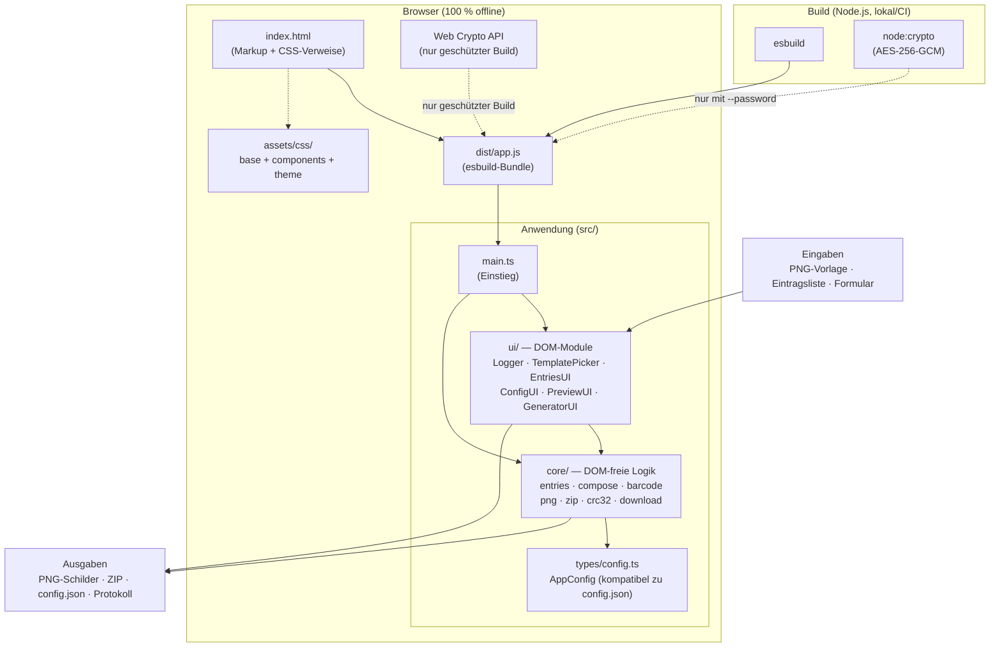
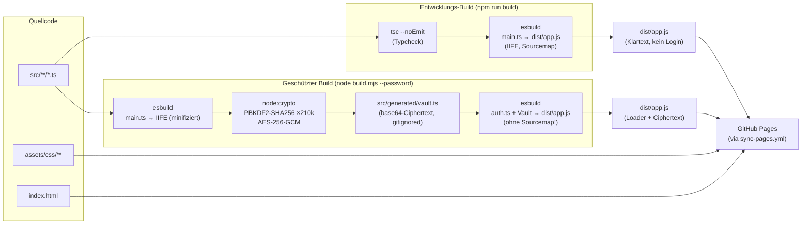
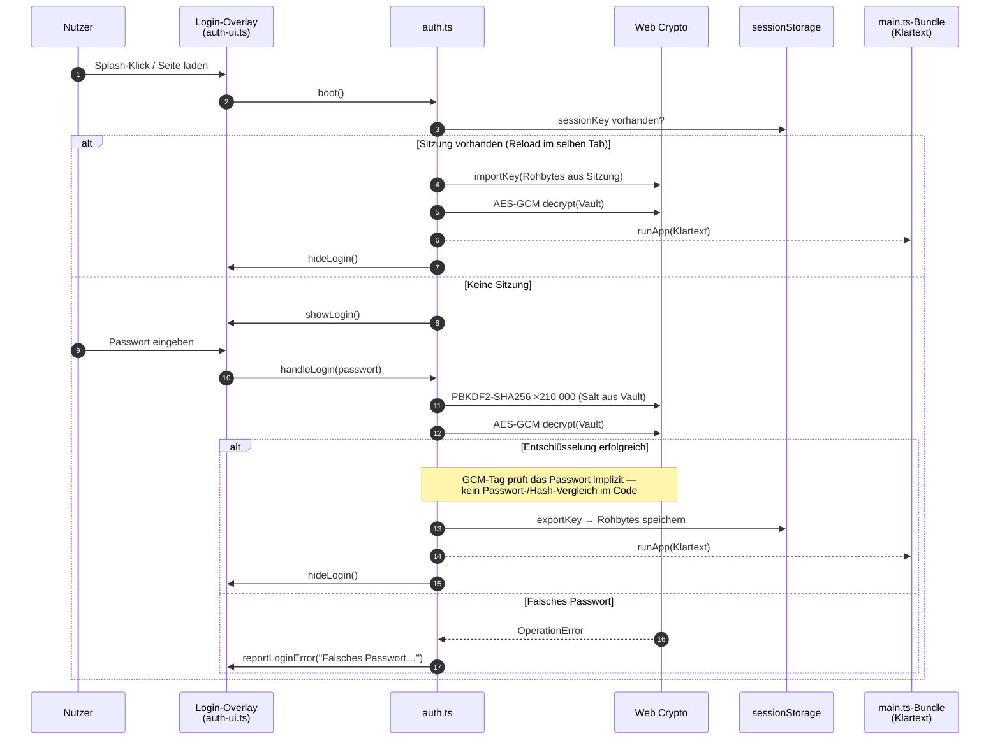
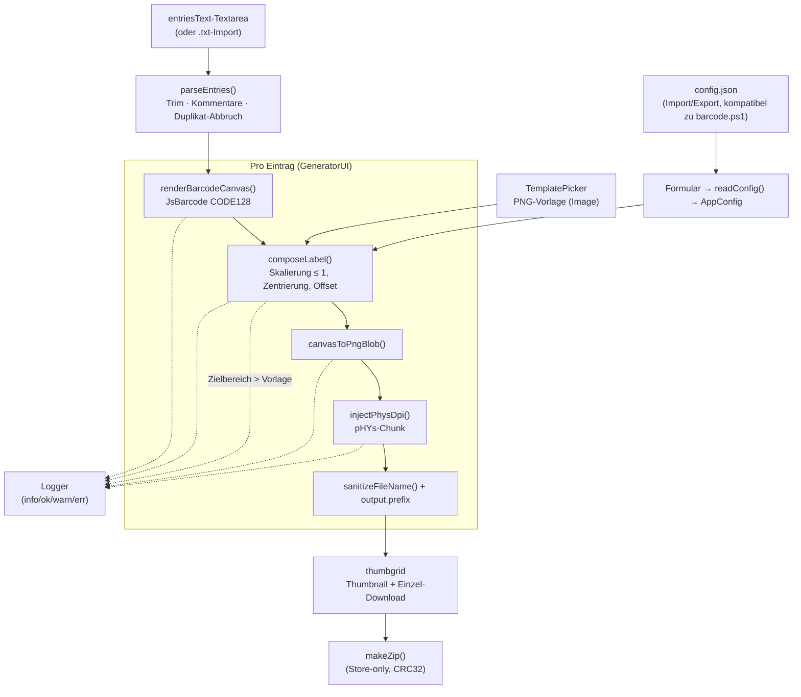
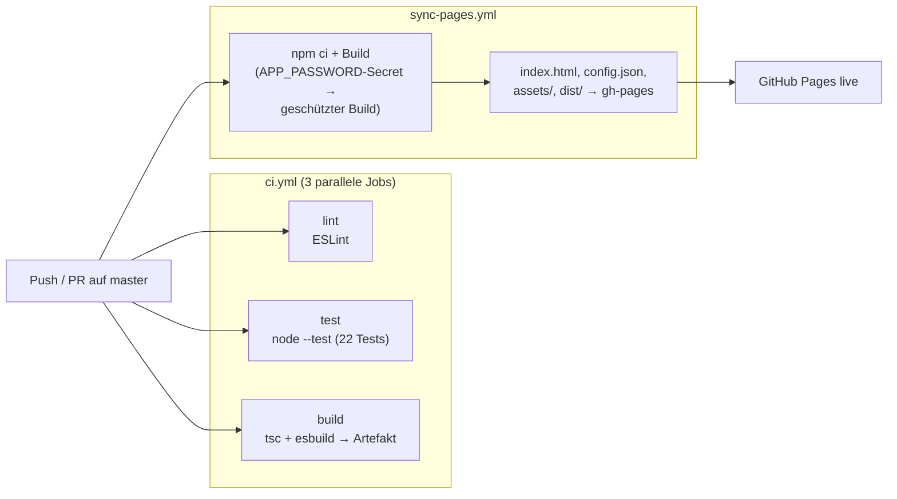

# Architektur — Lagerplatz-Barcode-Generator (HTML-Tool)

Dieses Dokument beschreibt die Architektur des browserbasierten HTML-Tools:
Module, Build-Pipeline, Authentifizierung und Datenfluss.

> Kommandozeilen-Werkzeuge (`barcode.ps1`, `barcode.mjs`, `skalieren.mjs`,
> `pruefen.mjs`, `konvertieren.mjs`) sind separat dokumentiert in der
> [Haupt-README](../README.md).

---

## 1. Systemübersicht

---

## 2. Module und Verantwortlichkeiten

### core/ — DOM-freie Logik

Alle Funktionen sind rein bzw. arbeiten nur mit Blob/ArrayBuffer und sind
deshalb einzeln unit-testbar (`test/unit/`).

| Modul | Exporte | Zweck |
|---|---|---|
| `entries.ts` | `parseEntries`, `sanitizeFileName` | Eintragsparsing (Kommentare, Trim, Duplikat-Abbruch), Dateinamen-Bereinigung |
| `compose.ts` | `composeLabel`, `ComposeResult` | **Herzstück**: Skalierung + Zentrierung des Barcodes im Zielbereich; Formel bewusst identisch zu `barcode.mjs` (`composeLabel`, Zeile 105) |
| `barcode.ts` | `renderBarcodeCanvas`, `canvasToPngBlob` | JsBarcode-Wrapper (CODE128) |
| `png.ts` | `injectPhysDpi` | pHYs-Chunk (DPI) in PNG injizieren |
| `zip.ts` | `makeZip`, `ZipEntry` | Store-only ZIP-Writer |
| `crc32.ts` | `crc32` | CRC32 (IEEE) für ZIP + PNG |
| `config.ts` | `readConfig`, `applyConfig`, `toggleAreaFields` | Formular ↔ `AppConfig` |
| `download.ts` | `downloadBlob` | Browser-Download auslösen |

### ui/ — DOM-Module

| Modul | Klasse/Funktionen | Zuständig für |
|---|---|---|
| `dom.ts` | `$()` | `getElementById` mit Fehler bei fehlender ID |
| `logger.ts` | `Logger` | Protokoll-Panel (info/ok/warn/err), Speichern als .txt |
| `splash.ts` | `initSplash` | Begrüßungs-Overlay bis Klick |
| `template-picker.ts` | `TemplatePicker` | Dropzone, Vorlagen-Vorschau, Change-Events |
| `entries-ui.ts` | `EntriesUI` | Textarea/.txt-Import, Duplikat-Anzeige, Vorschau-Select |
| `config-ui.ts` | `ConfigUI` | config.json Import/Export/Reset |
| `preview.ts` | `PreviewUI` | Einzelvorschau + Zielbereich-Overlay (Theme-Farbe `--preview-overlay`) |
| `generator.ts` | `GeneratorUI` | Stapel-Lauf, Progressbar, Thumbnails, ZIP-Download |
| `auth-ui.ts` | `showLogin`, `hideLogin`, `reportLoginError` | Login-Overlay (nur geschützter Build) |

### Einstiegspunkte

| Datei | Wird gebaut als | Zweck |
|---|---|---|
| `src/main.ts` | `npm run build` (unverschlüsselt) | Direkte App-Initialisierung |
| `src/auth.ts` | `node build.mjs --password "…"` (geschützt) | Login + Entschlüsselung, führt dann das `main.ts`-Bundle aus |

---

## 3. Build-Pipeline

**Regeln:**

- Im geschützten Modus wird **kein Sourcemap** erzeugt (would leak den
  Klartext) und minifiziert (kleinerer Ciphertext).
- `src/generated/vault.ts` entsteht nur beim geschützten Build und ist
  gitignored — im Repository liegt niemals ein Ciphertext oder Passwort.
- Der Dev-Build schreibt einen leeren Vault-Stub, damit `tsc` `auth.ts`
  typchecken kann.

---

## 4. Authentifizierungs-Flow (geschützter Build)

**Sicherheitsmodell:**

- Das Passwort wird **nirgends gespeichert** — auch nicht als Hash. Die
  Gültigkeit wird implizit durch den GCM-Authentifizierungs-Tag geprüft.
- In `sessionStorage` liegen nur die **abgeleiteten Schlüsselrohbytes**
  (nicht das Passwort); sie sterben mit dem Tab.
- Grenzen: Clientseitig ist das das Maximum — nach dem Entsperren liegt
  der Klartext im Browser-Speicher. Gegen einen Angreifer mit
  Rechnerzugriff hilft nur Server-Authentifizierung.

---

## 5. Datenfluss der Schilder-Erzeugung

---

## 6. CI/CD

Details und Command-Referenz: [Haupt-README](../README.md),
Modul-Referenz: [docs/api/README.md](api/README.md).
